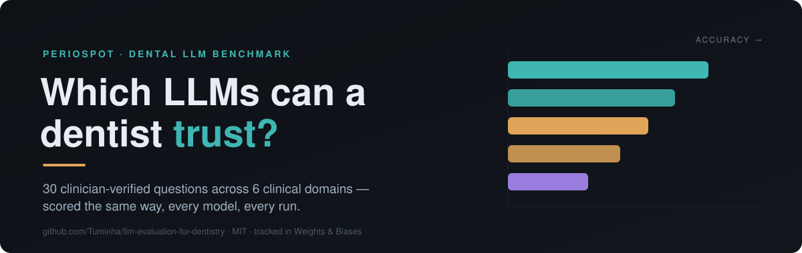
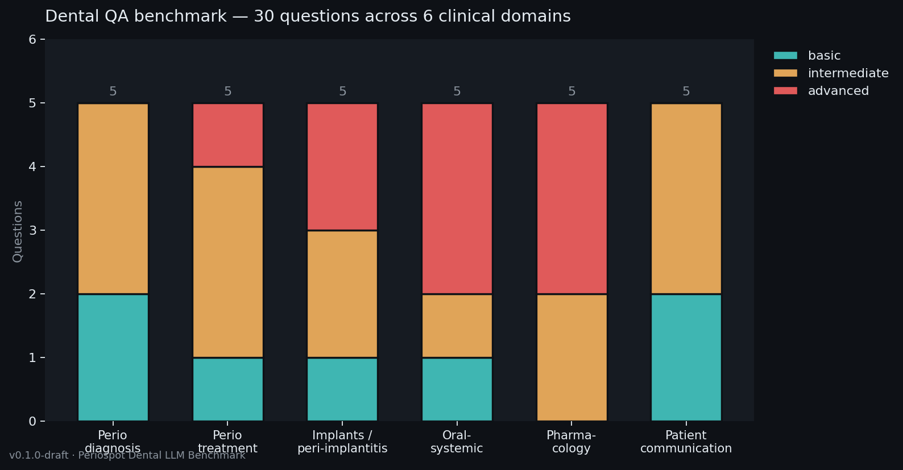
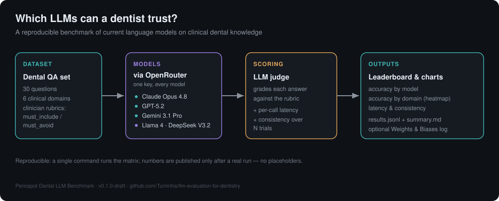
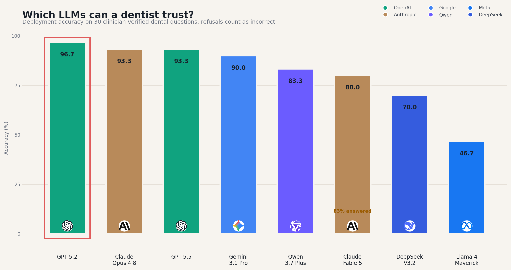
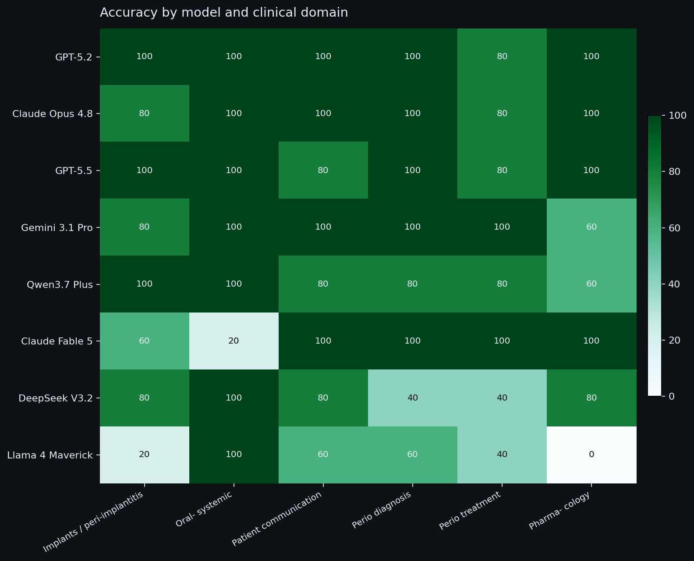

A reproducible benchmark that measures how well current large language models answer
**clinical dental questions** — across periodontics, implants, oral-systemic medicine,
pharmacology, and patient communication. Part of the [Periospot](https://periospot.com) project.

## Why this exists

LLMs are already being used to answer clinical questions — "what stage of periodontitis
is this?", "can I extract a tooth on a patient taking apixaban?". The models disagree,
and a fluent wrong answer is dangerous in a clinical context. Most public LLM benchmarks
test math, coding, and trivia; almost none test **dental knowledge against the actual
guidelines** (2017 World Workshop classification, EFP S3 treatment guideline, AAOMS MRONJ,
AHA/NICE prophylaxis).

This repo is that missing benchmark: a periodontist-authored question set with explicit
scoring rubrics, run across every major model through a single gateway, scored the same way
every time.

## The dataset

30 questions across 6 clinical domains, each with a difficulty level and a rubric that
defines what a correct answer must include — and the errors it must avoid.



Each question looks like this:

```json
{
  "id": "pharm-03",
  "domain": "pharmacology",
  "difficulty": "advanced",
  "question": "How should a routine dental extraction be managed in a patient taking warfarin, and in a patient taking a DOAC?",
  "rubric": {
    "must_include": ["Do NOT routinely stop anticoagulation without medical consultation",
                     "Warfarin: check a recent INR and proceed with local haemostatic measures if within range",
                     "..."],
    "must_avoid": ["Advising the dentist to unilaterally stop warfarin or DOAC for a simple extraction"]
  }
}
```

> **Status: clinician-reviewed, guideline-verified (v0.1.2).** The 10 most factual claims
> were checked against primary guideline sources — 9 confirmed, the perio–diabetes HbA1c
> figure corrected, two rubrics tightened — and the flagged wording items were then resolved
> (pharm-02 made jurisdiction-aware, diag-02 confirmed, the 20 conceptual items reviewed clean).
> Full record: [`VALIDATION.md`](VALIDATION.md). Dataset: [`data/dental_qa.json`](data/dental_qa.json).

## How scoring works



1. **Generation** — every model answers every question through [OpenRouter](https://openrouter.ai)
   (one API key reaches all of them, and the network path is identical, so latency is comparable).
2. **Judging** — an LLM judge grades each answer against the question's rubric: it counts how
   many `must_include` criteria are satisfied and flags any `must_avoid` violations. An answer
   is correct only if it satisfies **all** required criteria and commits **no** violations.
3. **Consistency** — each question is asked N times; we measure how much the answers drift.
4. **Latency** — wall-clock time per call is recorded for every request.

The judge is configurable (`--judge`), and judge bias is **measured, not assumed**: every
stored answer is re-scored by an independent second judge from a different vendor
([`src/judge_agreement.py`](src/judge_agreement.py)), with verdict agreement, Cohen's kappa,
and per-model deltas published in [`results/judge_agreement.md`](results/judge_agreement.md).
Refusals (a model declining to answer) are recorded as their own category — scored incorrect
for deployment-view accuracy, but labeled per row so answer-rate and accuracy-on-answered
can be reported separately.

## Quickstart

```bash
git clone https://github.com/Tuminha/llm-evaluation-for-dentistry.git
cd llm-evaluation-for-dentistry
python -m venv .venv && source .venv/bin/activate
pip install -r requirements.txt
cp .env.example .env          # then add your OPENROUTER_API_KEY
```

```bash
# Cheap sanity check — 3 questions, 1 trial, default lineup
python src/run_eval.py --smoke

# Full cross-provider run — 3 trials for consistency, log to Weights & Biases
python src/run_eval.py --trials 3 --wandb

# Single-provider pilots using only that provider's key (no OpenRouter needed)
python src/run_eval.py --backend anthropic --trials 3   # Claude family
python src/run_eval.py --backend openai --trials 3       # GPT family (incl. GPT-5.5)

# Custom lineup (keys from src/providers.py ROSTER)
python src/run_eval.py --models claude-opus-4.8,gpt-5.5,gemini-3.1-pro,llama-4-maverick
```

Three backends: `--backend openrouter` (default) reaches every provider through one key;
`--backend anthropic` and `--backend openai` run a single provider's family directly with
that provider's key — useful for a first pilot before wiring up OpenRouter.

You don't need an API key to regenerate the dataset chart:

```bash
python src/build_visuals.py
```

## The model lineup

Verified available on OpenRouter (lineup as of 2026-06-11). The default lineup — the eight
models in the results below — spans closed flagships, an efficient tier, and open-weight models:

| Tier | Models |
|---|---|
| Flagship | Claude Fable 5, Claude Opus 4.8, GPT-5.5, GPT-5.2, Gemini 3.1 Pro |
| Efficient | Qwen3.7 Plus *(plus available: Claude Haiku 4.5, GPT-5 mini, Gemini 2.5 Flash)* |
| Open-weight | Llama 4 Maverick, DeepSeek V3.2 |

Edit `ROSTER` in [`src/providers.py`](src/providers.py) to add or swap models.

## Results

> **Cross-provider run — 2026-06-10/11.** 30 clinician-verified questions × 8 models via
> OpenRouter, judged by Claude Opus 4.8 with full GPT-5.2 and GPT-5.5 second-judge passes,
> 1 trial. Real data, no placeholders; every answer transcript and judge verdict is in
> [`results/`](results/). The repository files are the source of truth.

| Model | Accuracy (95% CI) | Answer rate | Acc. on answered | Mean latency |
|---|---|---|---|---|
| GPT-5.2 | **96.7%** [90.0–100] | 100% | 96.7% | 14.8 s |
| Claude Opus 4.8 | 93.3% [83.3–100] | 100% | 93.3% | 12.1 s |
| GPT-5.5 | 93.3% [83.3–100] | 100% | 93.3% | 20.1 s |
| Gemini 3.1 Pro | 90.0% [76.7–100] | 100% | 90.0% | 20.5 s |
| Qwen3.7 Plus | 83.3% [70.0–96.7] | 100% | 83.3% | 40.8 s |
| Claude Fable 5 | 80.0% [66.7–93.3] | **83.3%** | **96.0%** | 16.5 s |
| DeepSeek V3.2 | 70.0% [53.3–86.7] | 100% | 70.0% | 34.1 s |
| Llama 4 Maverick | 46.7% [30.0–63.3] | 100% | 46.7% | 25.7 s |

CIs are bootstrap over questions (10k resamples, seed 42). Accuracy counts a refusal as a
failure (deployment view); "acc. on answered" is the capability view. Reproduce the table
and judge-agreement metrics with `python src/analysis.py`, which writes
[`results/analysis_tables.md`](results/analysis_tables.md).

**Key findings**

- **The flagship cluster is statistically tied.** GPT-5.2, Claude Opus 4.8, GPT-5.5, and Gemini 3.1
  Pro have heavily overlapping CIs — at n=30, no ranking among them is claimable. The gap
  between that cluster and the open-weight models is real and large.
- **Claude Fable 5 refused 5 of 30 questions** (perio–diabetes, pregnancy, smoking,
  Alzheimer's, supracrestal tissue attachment) — its safety layer emits a `refusal` stop,
  reproduced across both Amazon Bedrock and Anthropic first-party serving, twice cutting an
  answer off mid-stream. On the 25 questions it answered, it ties the leaders (96.0%). The
  refused topics are almost exactly the **oral-systemic evidence questions** — territory
  where clinicians most need calibrated answers. Refusal rows carry full provenance labels.
- **Pharmacology separates the field.** Llama 4 Maverick scored **0%** on pharmacology
  (MRONJ drugs, endocarditis prophylaxis, anticoagulants) — the domain where a wrong or
  missing answer is most dangerous. DeepSeek V3.2's weak spot is 2017 World Workshop
  staging/grading (40% on diagnosis).
- **Qwen3.7 Plus remains the efficient-tier surprise**: 83.3% deployment accuracy, ahead of
  Fable 5's deployment score because Fable refused clinically relevant questions.
- **Judge bias was measured, not assumed.** GPT-5.2 and GPT-5.5 independently re-scored the
  stored answers. GPT-5.2 agreed with Opus 4.8 on 81.7% of verdicts (kappa 0.506) over 235
  answered rows; GPT-5.5 agreed on 83.8% (kappa 0.524) over the same 235
  answered rows. Both OpenAI judges are stricter than Opus overall, and GPT-5.5 scores its
  own answers lower than Opus did (76.7% vs 93.3%). That argues for judge severity rather
  than simple same-family favoritism. Full tables: [`results/judge_agreement.md`](results/judge_agreement.md)
  and [`results/judge_agreement_gpt55.md`](results/judge_agreement_gpt55.md).
- **Run-to-run stability:** the protocol was run twice end-to-end on the original 5-model
  lineup; per-model accuracy shifted by at most one question (e.g. GPT-5.2 93.3→96.7).





**Caveats — read before citing.** n=30 means wide CIs — treat small gaps as noise; **1 trial**
per question (temperature 0; the consistency metric needs `--trials 3`); questions and rubrics
were authored and validated by **one periodontist** (guideline-verified:
[`VALIDATION.md`](VALIDATION.md)); absolute accuracy is **judge-dependent** (moderate
inter-judge agreement — ranks are stable, levels are not); latency reflects one gateway
(OpenRouter) on one day.

Reproduce or extend:

```bash
python src/run_eval.py --backend openrouter --trials 1   # this run
python src/judge_agreement.py                            # second-judge agreement pass
python src/judge_agreement.py --judge openai/gpt-5.5 \
  --outfile results/results_judge_gpt55.jsonl \
  --report results/judge_agreement_gpt55.md
python src/run_eval.py --trials 3 --wandb                # add consistency, log to W&B
```

## Repo layout

```
data/dental_qa.json     # the benchmark dataset (draft)
src/providers.py        # model roster + OpenRouter client
src/scorers.py          # LLM-judge + consistency scoring
src/run_eval.py         # CLI runner -> results/ + charts
src/build_visuals.py    # charts (dataset chart needs no API key)
assets/                 # committed README visuals
legacy/                 # original W&B Weave course notebooks (provenance)
```

## Roadmap

- **Done** — GPT-family pilot; full 8-model cross-provider run with answer transcripts
  (2026-06-10/11); second-judge agreement passes (GPT-5.2 and GPT-5.5 vs Opus 4.8);
  refusal detection with per-row provider/finish-reason provenance.
- **Next** — expand to ~75–100 questions; ≥3 trials for consistency; per-difficulty
  breakdowns; a third judge for a proper jury.
- **Later** — publish the validated dataset to Hugging Face under Periospot; quarterly
  re-runs as models change; a Periospot write-up of the findings.

## Contributing

The two highest-value contributions:

- **Add a question.** Append an entry to [`data/dental_qa.json`](data/dental_qa.json) with a
  clinician-written `must_include` / `must_avoid` rubric and a guideline source. New clinical
  claims should be verifiable against a current guideline (see [`VALIDATION.md`](VALIDATION.md)
  for the bar).
- **Add or swap a model.** Add an entry to a roster in [`src/providers.py`](src/providers.py)
  — `ROSTER` (OpenRouter), `CLAUDE_ROSTER`, or `OPENAI_ROSTER` — then run with `--models`.

Open an issue first if you're proposing a scoring or methodology change.

## How to cite

If you use this benchmark or dataset, please cite it:

```bibtex
@misc{teixeirabarbosa_dental_llm_benchmark_2026,
  author = {Teixeira Barbosa, Francisco},
  title  = {Periospot Dental LLM Benchmark: clinical dental knowledge evaluation for language models},
  year   = {2026},
  url    = {https://github.com/Tuminha/llm-evaluation-for-dentistry}
}
```

A machine-readable [`CITATION.cff`](CITATION.cff) is included, so GitHub renders a
"Cite this repository" button automatically.

## License

[MIT](LICENSE).

## Contact

Francisco Teixeira Barbosa — periodontist, founder of [Periospot](https://periospot.com),
Executive Director at the [Foundation for Oral Rehabilitation](https://www.for.org).

- Email: cisco@periospot.com
- GitHub: [@Tuminha](https://github.com/Tuminha)
- X: [@Cisco_research](https://x.com/Cisco_research)
